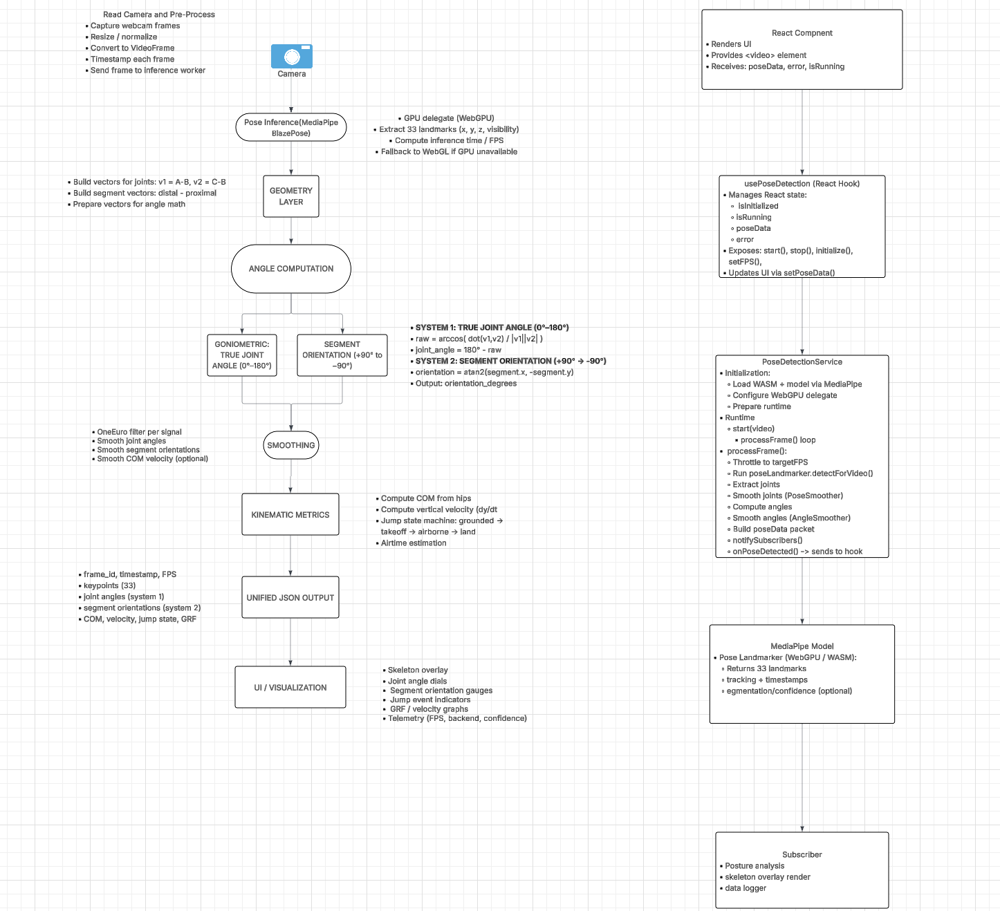

# pose_detection - MediaPipe BlazePose GHUM Detection with React

This project (`pose_detection`) implements real-time pose detection using MediaPipe BlazePose GHUM (WebGPU) in a React application. It includes model loading, inference at target FPS, joint mapping, angle computation, smoothing filters, and a stream API that sends JSON data to other modules for integration.

## Features

- ✅ **Model Loading**: Automatic initialization of MediaPipe BlazePose GHUM model with WebGPU support
- ✅ **Target FPS Control**: Configurable frame rate for inference (default: 60 FPS)
- ✅ **Joint Mapping**: Complete mapping of 33 body landmarks to named joints
- ✅ **Angle Computation**: Real-time calculation of joint angles (elbows, knees, shoulders, hips)
- ✅ **Smoothing Filters**: Multiple smoothing algorithms (EMA, One Euro Filter, Kalman Filter)
- ✅ **Stream API**: Subscribe to pose detection stream from any module

## Installation

```bash
npm install
```

## Usage

### Basic Usage in React Component

```jsx
import { usePoseDetection } from './hooks/usePoseDetection';

function MyComponent() {
  const {
    isInitialized,
    isRunning,
    poseData,
    initialize,
    start,
    stop,
  } = usePoseDetection({
    targetFPS: 60,
    smoothingAlpha: 0.5,
  });

  const handleStart = async () => {
    await initialize();
    const video = document.getElementById('video');
    await start(video);
  };

  return (
    <div>
      {poseData && (
        <div>
          <p>Left Elbow Angle: {poseData.angles?.leftElbow?.toFixed(1)}°</p>
          <p>Right Knee Angle: {poseData.angles?.rightKnee?.toFixed(1)}°</p>
        </div>
      )}
    </div>
  );
}
```

### Using the Pose Stream in Other Modules

The `pose_detection` module provides a stream API that sends pose data as JSON objects to subscribing modules. This allows other modules to receive real-time pose detection data without directly coupling to the detection service.

#### Basic Integration

```javascript
import { subscribeToPoseStream, getCurrentPoseData } from './modules/poseStream';

// Subscribe to pose updates - receives JSON data on each detection
const unsubscribe = subscribeToPoseStream((poseData) => {
  // poseData is a JSON object containing:
  // - landmarks: Array of 33 raw MediaPipe landmarks
  // - joints: Object with named joint positions
  // - angles: Object with computed joint angles
  // - timestamp: Detection timestamp
  // - confidence: Detection confidence score
  
  console.log('Pose detected:', poseData);
  console.log('Joints:', poseData.joints);
  console.log('Angles:', poseData.angles);
  
  // Process the JSON data as needed
  processPoseData(poseData);
});

// Get current pose data (returns JSON object or null)
const currentPose = getCurrentPoseData();

// Unsubscribe when done
unsubscribe();
```

#### JSON Data Format

The pose stream sends data in a standardized JSON format. Each detection event contains:

```json
{
  "landmarks": [
    {
      "x": 0.512,
      "y": 0.234,
      "z": -0.123,
      "visibility": 0.98
    }
    // ... 33 landmarks total
  ],
  "joints": {
    "NOSE": { "x": 0.512, "y": 0.234, "z": -0.123, "visibility": 0.98 },
    "LEFT_SHOULDER": { "x": 0.456, "y": 0.345, "z": -0.089, "visibility": 0.95 },
    "RIGHT_SHOULDER": { "x": 0.568, "y": 0.345, "z": -0.091, "visibility": 0.96 },
    "LEFT_ELBOW": { "x": 0.412, "y": 0.456, "z": -0.067, "visibility": 0.92 },
    // ... all 33 joints
  },
  "angles": {
    "jointAngles": {
      "leftElbow": 145.3,
      "rightElbow": 142.7,
      "leftKnee": 168.2,
      "rightKnee": 169.1,
      "leftShoulder": 175.4,
      "rightShoulder": 176.8,
      "leftHip": 172.3,
      "rightHip": 173.5
    },
    "segmentOrientations": {
      "leftUpperArm": 25.3,
      "rightUpperArm": -22.1,
      "leftForearm": 15.7,
      "rightForearm": -18.9,
      "leftThigh": 5.2,
      "rightThigh": 3.8,
      "leftShank": -2.1,
      "rightShank": -1.5,
      "trunk": 8.4
    }
  },
  "timestamp": 1234567890.123,
  "confidence": 0.94
}
```

**Schema Validation**: The complete JSON schema is defined in `pose-data-schema.json`. Use this schema to validate incoming data or generate TypeScript types.

**Example Data**: See `pose-data-example.json` for a complete example of the JSON structure.

#### Integration Patterns

##### Pattern 1: Simple Subscriber

```javascript
import { subscribeToPoseStream } from './modules/poseStream';

// Simple function that processes JSON pose data
function setupPoseProcessor() {
  const unsubscribe = subscribeToPoseStream((poseData) => {
    // Access joint angles
    const leftKneeAngle = poseData.angles.jointAngles.leftKnee;
    const rightKneeAngle = poseData.angles.jointAngles.rightKnee;
    
    // Access joint positions
    const leftHip = poseData.joints.LEFT_HIP;
    const rightHip = poseData.joints.RIGHT_HIP;
    
    // Your processing logic here
    if (leftKneeAngle && leftKneeAngle < 90) {
      console.log('Deep squat detected!');
    }
  });
  
  return unsubscribe;
}
```

##### Pattern 2: Class-Based Integration

```javascript
import { subscribeToPoseStream, isPoseStreamActive } from './modules/poseStream';

export class MyPoseModule {
  constructor() {
    this.unsubscribe = null;
    this.poseHistory = [];
  }
  
  start() {
    // Subscribe to receive JSON pose data
    this.unsubscribe = subscribeToPoseStream((poseData) => {
      // Store JSON data
      this.poseHistory.push(poseData);
      
      // Process the JSON object
      this.processPoseData(poseData);
    });
  }
  
  processPoseData(poseData) {
    // Extract data from JSON object
    const { joints, angles, timestamp } = poseData;
    
    // Your module logic here
    const kneeAngles = angles.jointAngles;
    if (kneeAngles.leftKnee && kneeAngles.rightKnee) {
      const avgKneeAngle = (kneeAngles.leftKnee + kneeAngles.rightKnee) / 2;
      this.onKneeAngleUpdate(avgKneeAngle);
    }
  }
  
  stop() {
    if (this.unsubscribe) {
      this.unsubscribe();
      this.unsubscribe = null;
    }
  }
}
```

##### Pattern 3: React Component Integration

```javascript
import { useEffect, useState } from 'react';
import { subscribeToPoseStream, getCurrentPoseData } from './modules/poseStream';

function MyPoseComponent() {
  const [poseData, setPoseData] = useState(null);
  
  useEffect(() => {
    // Subscribe to pose stream - receives JSON objects
    const unsubscribe = subscribeToPoseStream((data) => {
      // Update state with JSON data
      setPoseData(data);
    });
    
    // Cleanup on unmount
    return () => unsubscribe();
  }, []);
  
  if (!poseData) return <div>No pose data</div>;
  
  // Access JSON data
  const leftKneeAngle = poseData.angles.jointAngles.leftKnee;
  
  return <div>Left Knee Angle: {leftKneeAngle?.toFixed(1)}°</div>;
}
```

##### Pattern 4: Sending JSON to External Services

```javascript
import { subscribeToPoseStream } from './modules/poseStream';

// Send pose data as JSON to external API
function setupAPIIntegration(apiEndpoint) {
  const unsubscribe = subscribeToPoseStream((poseData) => {
    // Serialize to JSON string
    const jsonString = JSON.stringify(poseData);
    
    // Send to external service
    fetch(apiEndpoint, {
      method: 'POST',
      headers: { 'Content-Type': 'application/json' },
      body: jsonString
    }).catch(error => {
      console.error('Failed to send pose data:', error);
    });
  });
  
  return unsubscribe;
}
```

#### Initializing the Stream

Before subscribing, ensure the pose detection service is initialized and the stream is active:

```javascript
import { initializePoseStream } from './modules/poseStream';
import { PoseDetectionService } from './services/poseDetectionService';

// Initialize pose detection service
const poseService = new PoseDetectionService({
  targetFPS: 60,
  smoothingAlpha: 0.5
});

await poseService.initialize();

// Initialize the stream with the service
initializePoseStream(poseService);

// Now other modules can subscribe
const unsubscribe = subscribeToPoseStream((poseData) => {
  // Receive JSON pose data
});
```

#### Data Flow

```
pose_detection Module
    ↓
PoseDetectionService (detects pose)
    ↓
poseStream Module (converts to JSON)
    ↓
Subscribers (receive JSON objects)
    ↓
Your Module (processes JSON data)
```

#### TypeScript Support

For TypeScript projects, import the type definitions:

```typescript
import type { PoseData } from './pose-data-types';
import { subscribeToPoseStream } from './modules/poseStream';

const unsubscribe = subscribeToPoseStream((poseData: PoseData) => {
  // Type-safe access to JSON data
  const leftKnee = poseData.angles.jointAngles.leftKnee;
});
```

See `pose-data-types.ts` for complete TypeScript definitions.

### Available Joints

The system provides access to 33 body landmarks:

- **Face**: NOSE, LEFT_EYE, RIGHT_EYE, LEFT_EAR, RIGHT_EAR, etc.
- **Upper Body**: LEFT_SHOULDER, RIGHT_SHOULDER, LEFT_ELBOW, RIGHT_ELBOW, LEFT_WRIST, RIGHT_WRIST
- **Lower Body**: LEFT_HIP, RIGHT_HIP, LEFT_KNEE, RIGHT_KNEE, LEFT_ANKLE, RIGHT_ANKLE

### Computed Angles

The system automatically calculates:
- Elbow angles (left/right)
- Knee angles (left/right)
- Shoulder angles (left/right)
- Hip angles (left/right)

### Smoothing Filters

Three smoothing algorithms are available:
- **Exponential Moving Average (EMA)**: Simple and fast
- **One Euro Filter**: Adaptive smoothing based on velocity
- **Kalman Filter**: Advanced filtering for noisy data

## Integration with Other Modules

The `pose_detection` module is designed to be integrated with other modules or applications. It provides a standardized JSON interface for pose data exchange.

### Integration Overview

1. **JSON Data Format**: All pose data is sent as JSON objects following the schema defined in `pose-data-schema.json`
2. **Stream API**: Subscribe to real-time pose updates via `subscribeToPoseStream()`
3. **Schema Files**: Use `pose-data-schema.json` for validation and `pose-data-types.ts` for TypeScript support
4. **Example Data**: Reference `pose-data-example.json` for complete data structure examples

### Quick Integration Steps

1. **Import the stream module**:
   ```javascript
   import { subscribeToPoseStream } from 'pose_detection/src/modules/poseStream';
   ```

2. **Subscribe to receive JSON data**:
   ```javascript
   const unsubscribe = subscribeToPoseStream((poseData) => {
     // poseData is a JSON object
     console.log(JSON.stringify(poseData, null, 2));
   });
   ```

3. **Process the JSON data** in your module as needed

4. **Unsubscribe** when done:
   ```javascript
   unsubscribe();
   ```

For detailed integration examples, see the [Integration Patterns](#integration-patterns) section above.

## Project Structure

```
pose_detection/
├── src/
│   ├── services/
│   │   └── poseDetectionService.js    # Core pose detection service
│   ├── hooks/
│   │   └── usePoseDetection.js        # React hook for pose detection
│   ├── utils/
│   │   ├── jointMapping.js            # Joint name/index mapping
│   │   ├── angleComputation.js        # Angle calculation utilities
│   │   └── smoothingFilters.js       # Smoothing filter implementations
│   ├── modules/
│   │   └── poseStream.js              # Stream API for other modules
│   └── examples/
│       └── exampleModule.js           # Example usage patterns
├── pose-data-schema.json              # JSON schema for validation
├── pose-data-example.json             # Example JSON data
├── pose-data-types.ts                 # TypeScript type definitions
└── API_DOCUMENTATION.md               # Complete API reference
```

## Configuration Options

### usePoseDetection Hook Options

- `targetFPS` (number): Target frames per second (default: 30)
- `smoothingAlpha` (number): Smoothing factor 0-1 (default: 0.5)
- `modelPath` (string): Path to MediaPipe WASM files
- `modelAssetPath` (string): Path to pose model file

## API Reference

### PoseDetectionService

- `initialize()`: Load the pose model
- `start(videoElement)`: Start detection on video element
- `stop()`: Stop detection
- `subscribe(callback)`: Subscribe to pose updates
- `setTargetFPS(fps)`: Update target FPS
- `setSmoothingAlpha(alpha)`: Update smoothing factor

### Pose Data Structure (JSON Format)

The pose data is sent as a JSON object with the following structure:

```javascript
{
  landmarks: Array,        // Raw MediaPipe landmarks (33 items)
  joints: Object,          // Named joint positions {x, y, z, visibility}
  angles: Object,         // Computed joint angles (jointAngles + segmentOrientations)
  timestamp: number,      // Detection timestamp (milliseconds)
  confidence: number      // Detection confidence (0-1, or null)
}
```

**Note**: This data structure is serialized as JSON when sent through the stream API. See `pose-data-schema.json` for the complete JSON schema and `pose-data-example.json` for a full example.

```
+-----------------------------------------------------------+
|                       React Component                     |
|-----------------------------------------------------------|
| - Renders UI                                              |
| - Provides <video> element                                |
| - Calls: start(), stop()                                  |
| - Receives: poseData, error, isRunning                    |
+---------------------------+-------------------------------+
                            |
                            v
+-----------------------------------------------------------+
|                usePoseDetection (React Hook)              |
|-----------------------------------------------------------|
| - Creates PoseDetectionService instance                   |
| - Manages React state:                                    |
|     isInitialized                                         |
|     isRunning                                             |
|     poseData                                              |
|     error                                                 |
| - Exposes: start(), stop(), initialize(), setFPS(), etc. |
| - Updates UI via setPoseData()                            |
+---------------------------+-------------------------------+
                            |
                            v
+-----------------------------------------------------------+
|                 PoseDetectionService (Engine)             |
|-----------------------------------------------------------|
| Initialization:                                           |
|   - Load WASM + model via MediaPipe                      |
|   - Configure WebGPU delegate                             |
|   - Prepare runtime                                       |
|                                                           |
| Runtime:                                                  |
|   start(video)                                            |
|     -> processFrame() loop                                |
|                                                           |
| processFrame():                                           |
|   - Throttle to targetFPS                                 |
|   - Run poseLandmarker.detectForVideo()                   |
|   - Extract joints                                        |
|   - Smooth joints (PoseSmoother)                          |
|   - Compute angles                                        |
|   - Smooth angles (AngleSmoother)                         |
|   - Build poseData packet                                 |
|   - notifySubscribers()                                   |
|   - onPoseDetected() -> sends to hook                     |
|                                                           |
| API:                                                      |
|   start(), stop(), initialize()                           |
|   subscribe(callback)                                     |
|   setTargetFPS(), setSmoothingAlpha()                     |
|   dispose()                                               |
+---------------------------+-------------------------------+
                            |
                            v
+-----------------------------------------------------------+
|                       MediaPipe Model                     |
|-----------------------------------------------------------|
| Pose Landmarker (WebGPU / WASM):                          |
|   - Returns 33 landmarks                                  |
|   - Tracking + timestamps                                 |
|   - Segmentation/confidence (optional)                    |
+---------------------------+-------------------------------+
                            |
                            v
+-----------------------------------------------------------+
|                      Subscribers (Optional)               |
|-----------------------------------------------------------|
| - Rep counter                                             |
| - Posture analysis                                        |
| - Skeleton overlay renderer                               |
| - Data logger / analytics                                 |
| Receive poseData via notifySubscribers()                  |
+-----------------------------------------------------------+

```

## System Architecture Diagram




## Browser Requirements

- Chrome/Edge 90+ (for WebGPU support)
- Firefox 89+ (experimental WebGPU support)
- Safari 16.4+ (experimental WebGPU support)

## Troubleshooting

1. **WebGPU not available**: Ensure you're using a supported browser and have WebGPU enabled
2. **Model loading fails**: Check network connection and CDN availability
3. **Low FPS**: Reduce target FPS or use a lighter model variant

## Getting Started with Create React App

This project was bootstrapped with [Create React App](https://github.com/facebook/create-react-app).

## Available Scripts

In the project directory, you can run:

### `npm start`

Runs the app in the development mode.\
Open [http://localhost:3000](http://localhost:3000) to view it in your browser.

The page will reload when you make changes.\
You may also see any lint errors in the console.

### `npm test`

Launches the test runner in the interactive watch mode.\
See the section about [running tests](https://facebook.github.io/create-react-app/docs/running-tests) for more information.

### `npm run build`

Builds the app for production to the `build` folder.\
It correctly bundles React in production mode and optimizes the build for the best performance.

The build is minified and the filenames include the hashes.\
Your app is ready to be deployed!

See the section about [deployment](https://facebook.github.io/create-react-app/docs/deployment) for more information.

### `npm run eject`

**Note: this is a one-way operation. Once you `eject`, you can't go back!**

If you aren't satisfied with the build tool and configuration choices, you can `eject` at any time. This command will remove the single build dependency from your project.

Instead, it will copy all the configuration files and the transitive dependencies (webpack, Babel, ESLint, etc) right into your project so you have full control over them. All of the commands except `eject` will still work, but they will point to the copied scripts so you can tweak them. At this point you're on your own.

You don't have to ever use `eject`. The curated feature set is suitable for small and middle deployments, and you shouldn't feel obligated to use this feature. However we understand that this tool wouldn't be useful if you couldn't customize it when you are ready for it.

## Learn More

You can learn more in the [Create React App documentation](https://facebook.github.io/create-react-app/docs/getting-started).

To learn React, check out the [React documentation](https://reactjs.org/).

### Code Splitting

This section has moved here: [https://facebook.github.io/create-react-app/docs/code-splitting](https://facebook.github.io/create-react-app/docs/code-splitting)

### Analyzing the Bundle Size

This section has moved here: [https://facebook.github.io/create-react-app/docs/analyzing-the-bundle-size](https://facebook.github.io/create-react-app/docs/analyzing-the-bundle-size)

### Making a Progressive Web App

This section has moved here: [https://facebook.github.io/create-react-app/docs/making-a-progressive-web-app](https://facebook.github.io/create-react-app/docs/making-a-progressive-web-app)

### Advanced Configuration

This section has moved here: [https://facebook.github.io/create-react-app/docs/advanced-configuration](https://facebook.github.io/create-react-app/docs/advanced-configuration)

### Deployment

This section has moved here: [https://facebook.github.io/create-react-app/docs/deployment](https://facebook.github.io/create-react-app/docs/deployment)

### `npm run build` fails to minify

This section has moved here: [https://facebook.github.io/create-react-app/docs/troubleshooting#npm-run-build-fails-to-minify](https://facebook.github.io/create-react-app/docs/troubleshooting#npm-run-build-fails-to-minify)
